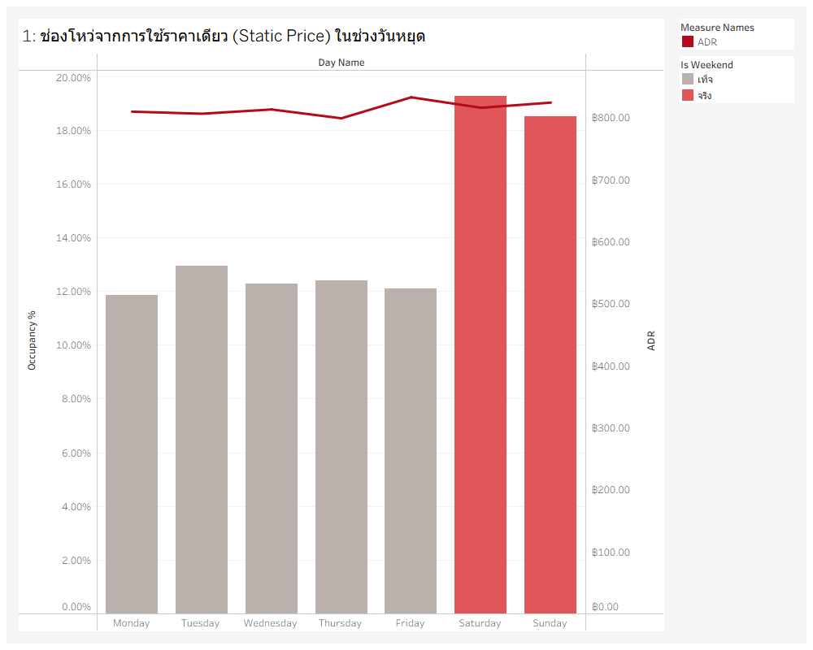
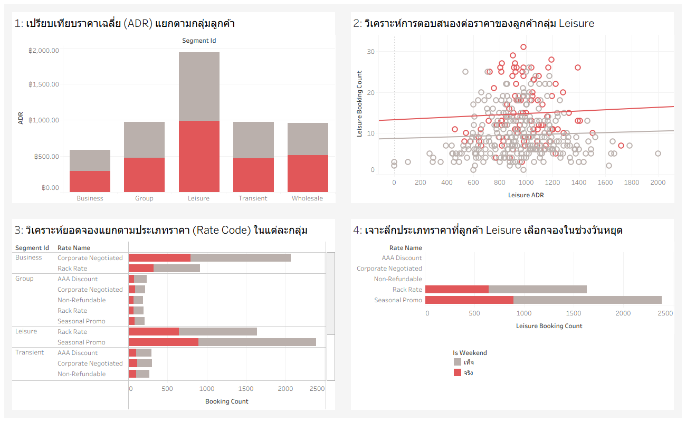
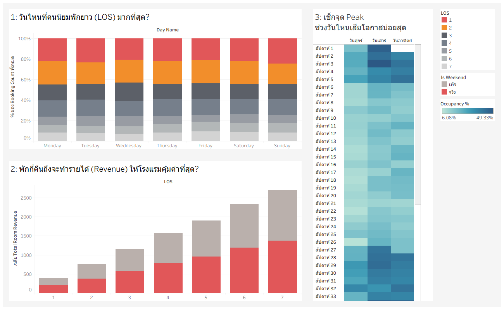
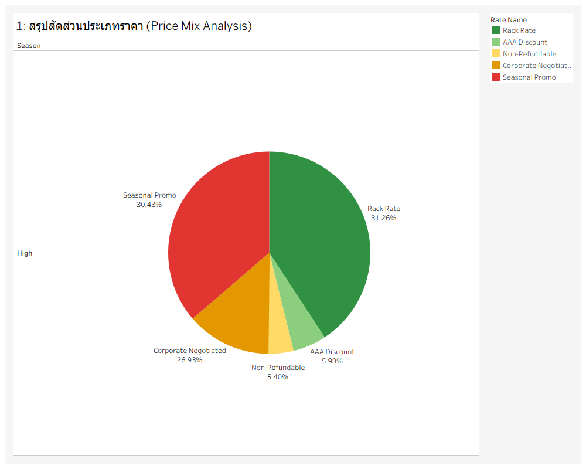
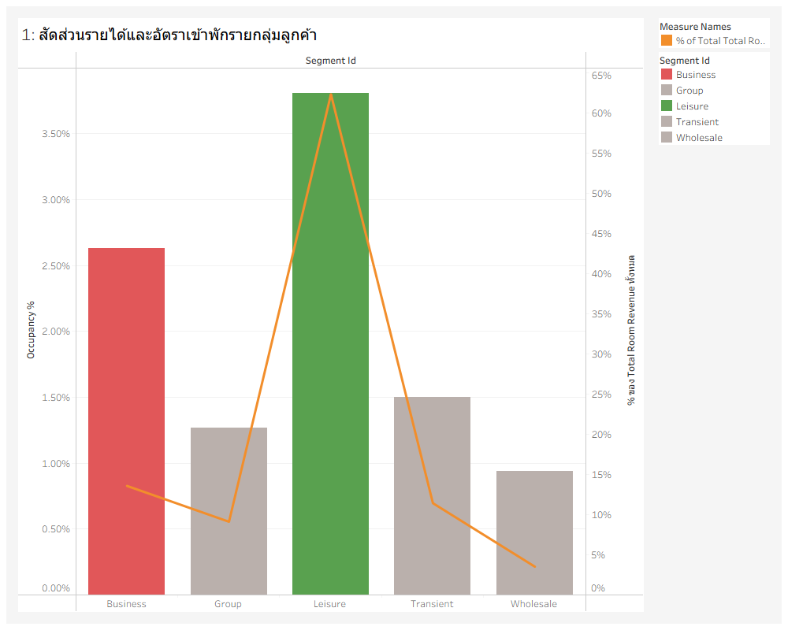
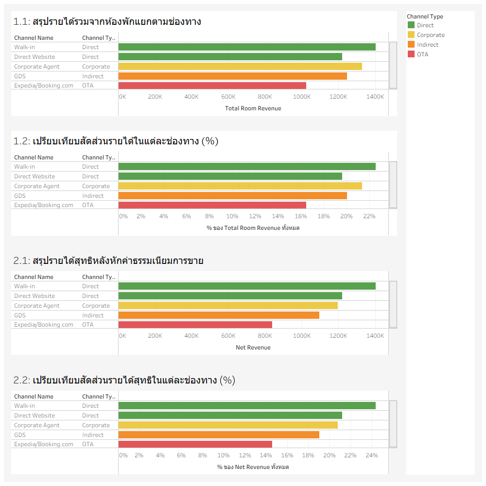
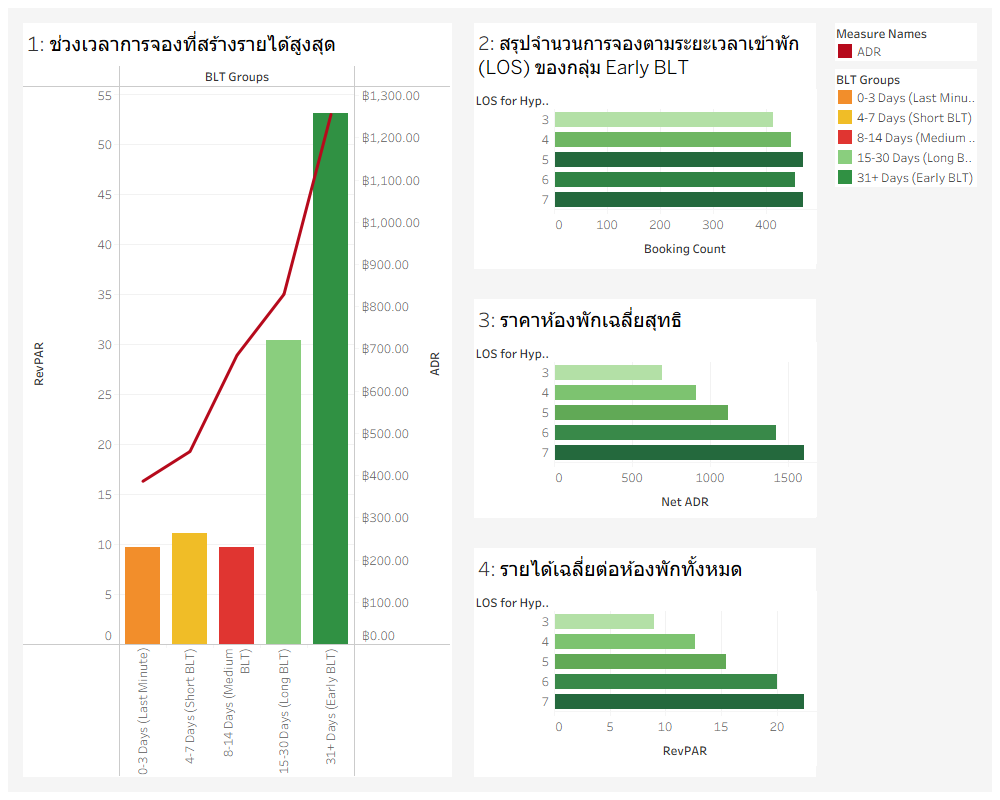

# **Hotel_Revenue_Management_Project**
Repository นี้ใช้เพื่อทำ Project วิชา CP372 Data Analytics and Business Intelligence

## **Member:**
- นายคุณานนต์ หฤทัยธรรม 66102010134
- นายณัฐนนท์ หลิมเหล็ก 66102010137
- นายสัณหธรรศน์ จึงธีรพานิช 66102010154

## **Project Canvas**


## **Background & Pain Points**

### **Scenario:** The Hotel Business Owner's Dilemma
### **Context:**
You own a mid-sized, independent hotel ("The Azure Stay"). While the property is beautiful, profitability is stagnant. You have identified three critical pain points that require data-driven solutions

### **Pain Points (Problem):**
**Revenue Stagnation:** Despite decent foot traffic, your Revenue Per Available Room (RevPAR) is lower than competitors, suggesting inefficient pricing and inventory management

**Goal:** Maximize revenue by selling the right room to the right customer at the right time.

## **SMART Objectives**

เพิ่ม RevPAR ขึ้นอย่างน้อย 10% เมื่อเทียบกับไตรมาสก่อนหน้า ภายใน 2 ไตรมาสหน้า จากการวิเคราะห์และปรับโครงสร้าง ADR ปรับกลยุทธ์การขายตาม Seasonality และปรับ Occupancy ให้เหมาะกับ Demand ของลูกค้าแต่ละกลุ่ม (Segmentation) จากฐานข้อมูลเดิมที่มีอยู่

## **Hypothesis & Method**

### **Hypothesis 1:** Dynamic Pricing Inefficiency

การใช้ราคาแบบ Static (ราคาเดียวตลอดสัปดาห์) ในวันศุกร์และเสาร์ ทำให้โรงแรมเสียโอกาสในการทำกำไร (Revenue Opportunity Loss) แม้จะมี Occupancy สูงก็ตาม

#### **Logic:**

หากข้อมูลแสดงให้เห็นว่า Occupancy ในวันหยุดสูง แต่ ADR เท่ากับวันธรรมดา แสดงว่าโรงแรม "ตั้งราคาต่ำเกินไป" เมื่อเทียบกับ Demand จริง

#### **Method:**

- เปรียบเทียบ Occupancy ของ Weekend กับ Weekday
-	เปรียบเทียบ ADR ของ Weekend กับ Weekday

#### **Goal:**

เพื่อพิสูจน์ว่ากลยุทธ์การตั้งราคาในวันหยุดนั้นไม่ได้สอดคล้องกับความต้องการ (Demand) และสามารถเพิ่ม ADR ในวันหยุดได้

---

### **Hypothesis 2:** Leisure Segment Price Elasticity

ลูกค้ากลุ่ม Leisure ที่เข้าพักในวันหยุด มีความอ่อนไหวต่อราคา (Price Sensitivity) ต่ำกว่าลูกค้ากลุ่มอื่น ทำให้โรงแรมสามารถปรับเพิ่มราคาในช่วง Weekend ได้มากกว่าปัจจุบัน

#### **Logic:**

ลูกค้าที่เที่ยววันหยุดมักจะยินดีจ่ายแพงกว่าเพื่อให้ได้พักในวันที่ตัวเองสะดวก หากเราวิเคราะห์ตาม Customer Segment จะพบว่ากลุ่มนี้มักจองผ่าน Rate Code ที่เป็น Rack Rate หรือ Promo ที่ไม่ได้ลดหย่อนมากนัก

#### **Method:**

- เปรียบเทียบ ADR แยกตาม Segment_id (Business vs Leisure) ในช่วง Weekend
- คำนวณ Price Elasticity เบื้องต้นจากการดูการเปลี่ยนแปลงของยอดจองเมื่อมีการใช้ Rate Code ต่างๆ

#### **Goal:**

เพื่อระบุกลุ่มเป้าหมายที่จะยอมรับการขึ้นราคา ADR ในวันหยุดได้

---

### **Hypothesis 3:** Stay Pattern Optimization (MLOS)

การไม่มีข้อกำหนดระยะเวลาเข้าพักขั้นต่ำ (Minimum Length of Stay - MLOS) ในวันเสาร์ ทำให้เกิดการเสียโอกาสในการขายห้องพักแบบต่อเนื่อง (Friday-Sunday) ส่งผลให้ RevPAR เฉลี่ยของทั้งช่วงสุดสัปดาห์ต่ำกว่าที่ควรจะเป็น

#### **Logic:**

หากลูกค้าจองแค่คืนวันเสาร์เพียงคืนเดียว (LOS = 1) อาจทำให้คืนวันศุกร์หรืออาทิตย์ที่เหลืออยู่ขายยากขึ้น การวิเคราะห์ LOS จะช่วยบอกได้ว่าเราควรบังคับจอง 2 คืนหรือไม่

#### **Method:**

- วิเคราะห์ Average LOS ของการจองที่มี Check-in ในวันศุกร์และเสาร์
-	คำนวณ Total Revenue ของการจองแบบ 1 คืน vs 2 คืน ในช่วงวันหยุด

#### **Goal:**

เพื่อเสนอแนะการใช้กลยุทธ์ MLOS เพื่อดึงค่า RevPAR ในภาพรวมของสัปดาห์ให้สูงขึ้น

---

### **Hypothesis 4:** Rate Code Dilution (การใช้โปรโมชั่นพร่ำเพรื่อในฤดูกาลท่องเที่ยว)

การใช้ Rate Code ประเภท 'Seasonal Promo' หรือ 'AAA Discount' ในช่วง High Season มีสัดส่วนที่สูงเกินความจำเป็น ส่งผลให้ ADR เฉลี่ยลดลง (Dilution) ทั้งที่ความต้องการห้องพักสูงอยู่แล้ว

#### **Logic:**

ในช่วงที่คนอยากพักเยอะ เราไม่จำเป็นต้องลดราคา สมมติฐานนี้ต้องการพิสูจน์ว่าโรงแรมกำลัง "แจกส่วนลด" ให้คนที่ยินดีจ่ายราคาเต็มอยู่แล้วหรือไม่

#### **Method:**

- วิเคราะห์ Rate Code Distribution (สัดส่วนการใช้ราคาแต่ละประเภท) แยกตาม Season

#### **Goal:**

เพื่อกำหนดนโยบาย "Blackout Dates" (งดใช้โปรโมชั่น) ในช่วง High Season

---

### **Hypothesis 5:** Low Season Segment Pivot (การปรับกลุ่มเป้าหมายในฤดูกาลท่องเที่ยวต่ำ)

ในช่วง Low Season (May-June, Oct-Nov) รายได้หลักถูกขับเคลื่อนโดยกลุ่ม 'Business' มากกว่า 'Leisure' การทำโปรโมชั่นที่เน้นนักท่องเที่ยวในช่วงนี้จึงไม่ได้ประสิทธิภาพเท่ากับการทำโปรโมชั่นกับบริษัท (Corporate)

#### **Logic:**

เมื่อนักท่องเที่ยวลดลงตามฤดูกาล แต่กลุ่มคนทำงานหรือสัมมนา (Business/Corporate) ยังมีการเดินทางอยู่ การทุ่มงบการตลาดไปที่ Leisure ในช่วง Low Season อาจเป็นต้นทุนที่สูญเปล่า

#### **Method:**

- วิเคราะห์สัดส่วน segment_id แยกตามเดือน เพื่อดูว่ากลุ่มไหนทำรายได้สูงสุดในแต่ละฤดูกาล

#### **Goal:**

เพื่อปรับเปลี่ยนกลยุทธ์การขาย (Sales Strategy) ให้เน้นเจาะกลุ่ม Corporate ในช่วง Low Season เพื่อพยุง Occupancy ไม่ให้ตกลง

---

### **Hypothesis 6:** Channel revenue Analysis

รายได้จากการจองผ่านช่องทางต่าง ๆ ของโรงแรมส่วนใหญ่เป็นช่องทางอื่น ๆ มากกว่าตรง (Direct) แต่เมื่อพิจารณาแล้วจะพบว่าช่องทางอื่น ๆ มีการเสียค่า Commission ที่เยอะมาก ซึ่งส่งผลให้โรงแรมเสียรายได้ที่ควรจะเป็นของโรมแรม ถ้าสามารถผลักดันให้ลูกค้าจองผ่านช่องทางตรงได้เพิ่มขึ้นจะสามารถทำให้โรงแรมกลับมาสร้างรายได้อย่างมีประสิทธิภาพมากขึ้น

#### **Logic:**

ลูกค้าส่วนใหญ่ไม่ได้เข้าเว็บไซต์โรงแรมเพื่อจองที่พัก แต่นิยมเลือกโรงแรมเข้าพักจากช่องทางอื่น ๆ เช่น OTA หรือ GDS การที่เราไม่ผลักดันให้ลูกค้าจองผ่านช่องทางตรงจะส่งผลให้เราเสียรายได้ที่ควรจะได้ไป

#### **Method:**

-	วิเคราะห์รายได้ผ่านช่องทางต่าง ๆ **ก่อน**คิดค่า Commission
-	วิเคราะห์รายได้ผ่านช่องทางต่าง ๆ **หลัง**คิดค่า Commission

#### **Goal:**

เพื่อทำให้โรงแรมกลับมาสร้างรายได้อย่างมีประสิทธิภาพมากขึ้นอย่างที่ควรจะเป็น

---

### **Hypothesis 7:** The "Sweet Spot" Lead Time (ช่วงเวลาทองของการจองที่ทำกำไรสูงสุด)

การจองที่มี BLT อยู่ในช่วง 7-14 วัน ให้ค่า RevPAR สูงที่สุดเมื่อเทียบกับช่วงเวลาอื่น เนื่องจากเป็นช่วงที่ความต้องการ (Demand) เริ่มคงที่และโรงแรมไม่ต้องใช้โปรโมชั่นลดราคาหนักเท่ากลุ่ม Early-bird

#### **Logic:**

กลุ่มจองนานเกินไปมักได้ส่วนลด (Early Bird) ส่วนกลุ่มจองสั้นเกินไปมักมีความเสี่ยงเรื่องห้องว่าง (Unsold Rooms) สมมติฐานนี้ต้องการหาว่า "ช่วงเวลาไหน" ที่ลูกค้าสู้ราคาที่สุด

#### **Method:**

-	ทำกราฟ Scatter Plot ระหว่าง BLT (แกน X) และ ADR/RevPAR (แกน Y) เพื่อหาจุด Peak ของรายได้

#### **Goal:**

เพื่อปรับราคาให้เป็น Dynamic ตามระยะเวลาการจอง (Booking Window)

---

## **Logical folder structure**

```
├── data/
│   ├── raw/                 # ไฟล์ CSV ที่ Generate มาตอนแรก
│   └── processed/           # ไฟล์ CSV ที่ผ่านการทำ Clean/Join (ถ้ามี)
├── notebooks/
│   └── eda_analysis.ipynb   # โค้ด Python/Pandas ที่ใช้ดูข้อมูลเบื้องต้น
├── dashboards/
│   └── azure_stay_bi.twbx   # ไฟล์ Tableau หรือภาพ Screenshot ของ Dashboard
├── README.md                # สรุปโปรเจคและ Insights
└── presentation.pdf         # สไลด์สำหรับพรีเซนต์ 7 นาที
```

## **The AI-generated dataset**
- [fact_booking.csv](./data/fact_bookings.csv)
- [dim_room_type.csv](./data/dim_room_type.csv)
- [dim_room_inventory.csv](./data/dim_room_inventory.csv)
- [dim_rate_codes.csv](./data/dim_rate_codes.csv)
- [dim_channels.csv](./data/dim_channels.csv)
- [dim_calendar.csv](./data/dim_calendar.csv)

## **Prompt is used for generating data**
ในการ generate dataset ชุดนี้ขึ้นมาใช้ทั้งหมด 2 prompt ตามลำดับดังนี้

1. First_propmt
```
ตอนนี้ฉันกำลังทำ Project วิชา Data Analytics and Business Intelligence สำหรับการทำ Project วิชานี้

ฉันต้องการให้คุณ generate prompt สำหรับสร้าง dataset ในรูปแบบของไฟล์ Excel (.xlsx) ภายใต้บริบทดังนี้

Scenario: The Hotel Business Owner's Dilemma
Context: You own a mid-sized, independent hotel ("The Azure Stay"). While the property is beautiful, profitability is stagnant. You have identified critical pain points that require data-driven solutions:

Problem: Revenue Stagnation: Despite decent foot traffic, your Revenue Per Available Room (RevPAR) is lower than competitors, suggesting inefficient pricing and inventory management

Goal: ​​Maximize revenue by selling the right room to the right customer at the right time.

โดย Project นี้เรามี Smart Objectives Value Propositions คือ 
"
เพิ่ม RevPAR ขึ้นอย่างน้อย 10% เมื่อเทียบกับไตรมาสก่อนหน้า ภายใน 2 ไตรมาสหน้า จากการวิเคราะห์และปรับโครงสร้าง ADR ปรับกลยุทธ์การขายตาม Seasonality และปรับ Occupancy ให้เหมาะกับ Demand ของลูกค้าแต่ละกลุ่ม (Segmentation) จากฐานข้อมูลเดิมที่มีอยู่
"

Measures & Dimensions 
These are the quantitative metrics used to evaluate performance.

1. RevPAR (Revenue Per Available Room)
Definition: A performance metric used to assess the hotel's ability to fill available rooms at an average rate.
Calculation Formula: Total Room Revenue / Total Rooms Available
Range of Values: $0 - Max Potential Rate

2. ADR (Average Daily Rate)
Definition: The average rental income per paid occupied room in a given time period.
Calculation Formula: Total Room Revenue / Number of Rooms Sold
Range of Values: $0 - Rack Rate

3. OCC (Occupancy)
Definition: The percentage of available rooms that were sold during a specific period.
Calculation Formula: (Number of Rooms Sold / Total Rooms Available) * 100
Range of Values: 0% - 100%

4. LOS (Length of Stay)
Definition: The duration of a guest's visit, measured in nights. Important for analyzing guest behavior and cleaning costs.
Calculation Formula: Check-out Date - Check-in Date
Range of Values: 1 - 365+ (depending on policy)

5. BLT (Booking Lead Time)
Definition: The number of days between the booking date and the arrival date
Calculation Formula: Arrival Date - Booking Date
Range of Values: 0 - 365+ days

Key Dimensions
These are the categorical attributes used to slice and dice the measures.

1. Day of Week
Definition: The specific day the room is occupied (critical for weekend vs. weekday analysis).
Set of Possible Values: Mon, Tue, Wed, Thu, Fri, Sat, Sun

2. Booking Channel
Definition: The source where the reservation originated (high cost vs. low cost channels).
Set of Possible Values: Direct Website, OTA (Expedia, Booking.com), Walk-in, Corporate Agent, GDS

3. Rate Code
Definition: The specific price package or discount applied to the reservation.
Set of Possible Values: Rack Rate, AAA Discount, Corporate Negotiated, Non-Refundable, Seasonal Promo

4. Room Type
Definition: The physical category of the room inventory.
Set of Possible Values: Standard Queen, Deluxe King, Suite, Ocean View

5. Customer Segment
Definition: Classification of the guest's travel purpose.
Set of Possible Values: Business, Leisure, Group, Transient, Wholesale

Sample Dataset
To calculate the measures above and derive insights, you would need a relational dataset typically exported from a Property Management System (PMS). Here is the schema structure:

Table 1: fact_bookings
This is the main transactional table containing one row per reservation.
- booking_id (Primary Key): Unique identifier for the reservation (e.g., RES-10023).
- guest_id: Unique identifier for the guest.
- booking_date: The date the reservation was made.
- check_in_date: The scheduled arrival date.
- check_out_date: The scheduled departure date.
- room_type_id: Foreign key linking to the Room Type dimension.
- rate_code_id: Foreign key linking to the Rate Code dimension.
- channel_id: Foreign key linking to the Booking Channel dimension.
- segment_id: Foreign key linking to the Customer Segment dimension.
- status: Status of booking (e.g., Confirmed, Cancelled, Checked-Out, No-Show).
- total_room_revenue: The total revenue generated from the room rent (excluding taxes/extras).
- number_of_rooms: Number of rooms booked in this specific reservation.
- adults_count: Number of adults.
- children_count: Number of children.

Table 2: dim_room_inventory
This table defines the hotel's capacity. It is essential for calculating "Total Rooms Available" for RevPAR and Occupancy.
- date (Primary Key): A specific calendar date (e.g., 2025-10-01).
- total_capacity: Total physical rooms in the hotel.
- rooms_out_of_order: Number of rooms unavailable due to maintenance (cannot be sold).
- rooms_available_for_sale: total_capacity - rooms_out_of_order.

Table 3: dim_rate_codes
A lookup table for pricing strategies.
- rate_code_id (Primary Key): E.g., RC_CORP.
- rate_name: E.g., "Corporate Flat Rate".
- description: Description of inclusions (e.g., "Includes Breakfast & Wifi").
- is_commissionable: Boolean (True/False) indicating if a commission is paid to a 3rd party.

Table 4: dim_channels
A lookup table for booking sources.
- channel_id (Primary Key): E.g., CH_EXP.
- channel_name: E.g., "Expedia".
- channel_type: E.g., "OTA", "Direct", "Wholesaler".
- commission_rate: The percentage fee paid to the channel (e.g., 0.15 for 15%).

Table 5: dim_calendar (Optional but Recommended)
A standard date dimension to make "Day of Week" analysis easier.
- date_key: Date format YYYY-MM-DD.
- day_name: Monday, Tuesday, etc.
- is_weekend: Boolean flag.
- is_holiday: Boolean flag for public holidays.
- season: High Season, Low Season, Shoulder Season.

Project Evaluation Rubric (Total 100 Points)

Section 1: Strategic Alignment (15 Points)
This section evaluates how well the group understands the business context and defines success.
1.1
Criteria: Background & Pain Points
Points: 7
Description of Excellence: Clearly articulates the "Azure Stay" dilemma. Correctly identifies the specific problem chosen (Revenue Stagnation, High Costs, or Leakage) and its impact on profitability.

1.2
Criteria: SMART Objectives
Points: 8
Description of Excellence: Objectives are Specific, Measurable, Achievable, Relevant, and Time-bound. They align with the goals mentioned in the scenario (e.g., maximizing Net RevPAR or reducing No-Shows).

Section 2: Analytical Design (25 Points)
This section evaluates the logic used to set up the data investigation.
2.1
Criteria: Hypothesis & Method
Points: 10
Description of Excellence: Develops testable 3 hypotheses and correctly applies formulas (e.g., Net ADR or Cancellation Rate).

2.2
Criteria: GitHub Documentation
Points: 15
Description of Excellence: The repository is professionally organized with a clear README.md explaining the project. Includes code scripts, the AI-generated dataset, and a logical folder structure. Commit history shows consistent progress.  Set it as a public repository.  Thai or English is acceptable.

Section 3: Data Execution & EDA (30 Points)
This section focuses on the technical application and the quality of the AI-generated dataset.
3.1
Criteria: AI Data Quality 
Points: 10
Description of Excellence: AI-generated data strictly adheres to the required schema (e.g., fact_bookings, dim_channels, dim_guests).  Declare your prompt that is used for generating data.  Declare definitions and descriptions.  For any measure, declare how to calculate.  For any dimension derived from a conditional statement, declare it.  

3.2
Criteria: EDA & Visualizations
Points: 20
Description of Excellence: Explain clearly what you want to explore in EDA.  Uses high-quality charts to analyze measures by critical dimensions like Booking Channel, Rate Code, or Policy Type.  Every chart must have your explanation why it is an appropriate choice.

Section 4: Insights & Impact (15 Points)
This section evaluates the "Business Intelligence" aspect—turning data into value.
4.1
Criteria: Findings (Insights)
Points: 7
Description of Excellence: Accurately interprets results to identify the "root cause" of the problem (e.g., identifying "Serial Cancellers").

4.2
Criteria: Recommendations
Points: 8
Description of Excellence: Provides actionable advice, such as optimizing marketing spend for high-profit channels or adjusting penalty types.

Section 5: Communication & Presentation (15 Points)
This section evaluates the live delivery and professional quality.
5.1
Criteria: Live Presentation
Points: 10
Description of Excellence: Professional delivery, clear slides, and effective storytelling. The group handles Q&A with confidence, demonstrating a deep understanding of their data and the hotel's business logic.

5.2
Criteria: Participant Questioning
Points: 5
Description of Excellence: Group members participate mastery by contributing on questioning to the presenters. Every group representative (participant side) contributes to defending the analytical choices.  For each group presentation, timing is set at 10 minutes (7 minutes for presentation and 3 minutes for Q&A).  Questions must reflect your understanding in analytics.

Dataset ที่ฉันต้องการให้คุณ Generate นั้นต้องมี Data Quality Rules
1. Completeness ไม่ต้องมาทำขั้นตอน Data cleaning อีกเลย
2. Consistency (ความสอดคล้อง)

โดยต้องการข้อมูลอย่างน้อย 10,000 records

แพทเทิร์นที่ต้องการให้ซ่อนไว้ (Embedded Insights & Patterns)
ภายใน Dataset ต้องมีข้อมูลที่มี insights & patterns สอดคล้องกับ Objective โดยไม่ต้องบอกฉัน แต่ฉันต้องสามารถที่จะหา insights & patterns ได้จากกระบวนการทำ EDA 
```

2. Second_propmt.txt
```
📋 The Master Prompt for Dataset Generation
Role: You are a Senior Data Engineer and Revenue Management Consultant for "The Azure Stay" hotel.
Task: Generate a comprehensive synthetic dataset for a Hotel BI Project. The output must be an Excel file (.xlsx) with 5 sheets corresponding to the provided schema.
Business Context & Hidden Patterns (Critical):
The dataset must contain subtle "pain points" and "opportunities" that I can discover during EDA:

The Weekend Gap: Weekends (Fri-Sat) have high Occupancy but the ADR is nearly identical to weekdays, showing a failure to capture premium weekend demand.
Channel Leakage: The "OTA" channel has the highest volume but also the highest cancellation rates and lowest Net ADR (after accounting for a 15-20% commission).
Seasonality Misalignment: During "High Season" (Dec-Jan, July-Aug), the hotel reaches 100% occupancy too early, suggesting the "Rack Rate" was set too low.
Segment Behavior: "Business" guests have high ADR but short LOS (1-2 nights), while "Leisure" guests stay longer (4+ nights) but only book during "Seasonal Promo".
Dataset Requirements:

Rows: At least 10,000 records in fact_bookings.
Date Range: 1 year of historical data (e.g., April 2025 to March 2026).
Quality: No missing values, referential integrity between tables must be perfect.
Schema to Follow:

fact_bookings: (booking_id, guest_id, booking_date, check_in_date, check_out_date, room_type_id, rate_code_id, channel_id, segment_id, status, total_room_revenue, number_of_rooms, adults_count, children_count). Note: Ensure LOS and BLT can be calculated from dates.
dim_room_inventory: (date, total_capacity [set at 150], rooms_out_of_order [random 0-5], rooms_available_for_sale).
dim_rate_codes: (RC_RACK, RC_AAA, RC_CORP, RC_NONREF, RC_PROMO).
dim_channels: (Direct, OTA, Walk-in, Corporate, GDS) with corresponding commission rates.
dim_calendar: Standard date dimension including Day of Week, Weekend flag, and Seasonality.
Instructions for AI:
Please write and execute a Python script using pandas and numpy to generate this data. Ensure the total_room_revenue is logically tied to room_type and rate_code. After generating, provide a download link for the .xlsx file.
```

## **Data Dictionary**

### **fact_bookings**
| **Attribute** | **Description** | **Data Type** | **Valid Range/Example** |
| --- | --- | --- | --- |
| booking_id | รหัสหมายเลขการจอง (Unique Identifier) | Ordinal | RES-10040, RES-12017 |
| guest_id | รหัสอ้างอิงข้อมูลผู้เข้าพัก (Unique Identifier) | Ordinal | G-2500, G-2109 |
| booking_date | วันที่ทำการจองห้องพัก | Interval (Date) | 2025-08-10, 2025-10-25 |
| check_in_date | วันที่ผู้เข้าพักเช็คอิน | Interval (Date) | 2025-10-25, 2026-03-31 |
| check_out_date | วันที่ผู้เข้าพักเช็คเอาท์ | Interval (Date) | 2026-01-26, 2026-04-02  |
| room_type_id | รหัสประเภทห้องพักที่จอง (Unique Identifier) | Nominal | RT_SUI, RT_SQ |
| rate_code_id | รหัสเรทราคาที่ใช้ในการจอง (Unique Identifier) | Nominal | RC_CORP, RC_RACK |
| channel_id | รหัสช่องทางที่ใช้จอง (Unique Identifier) | Nominal | CH_WALK, CH_OTA |
| segment_id | รหัสกลุ่มตลาดของลูกค้า (Unique Identifier) | Nominal | Business, Leisure |
| status | สถานะการจอง | Nominal | Confirmed, Checked-Out, Cancelled, No-Show |
| total_room_revenue | รายได้รวมจากค่าห้องพักของการจองครั้งนี้ | Ratio (Continuous) | [0, Infinity] |
| number_of_room | จำนวนห้องที่จองภายใต้เลขการจองนี้ | Ratio (Discrete) | [0, 150] |
| adults_count | จำนวนผู้ใหญ่ | Ratio (Discrete) | 0, 3 |
| children_count | จำนวนเด็ก | Ratio (Discrete) | 0, 1 |

### **dim_room_type**
| **Attribute** | **Description** | **Data Type** | **Valid Range/Example** |
| --- | --- | --- | --- |
| room_type_id | รหัสประเภทห้องพักที่จอง (Unique Identifier) เชื่อมกับ fact_bookings.csv (room_type_id) | Nominal | RT_DK, RT_OV |
| room_type_name | ชื่อประเภทห้องพัก | Nominal | Standard Queen, Deluxe King |
| base_rate | ราคามาตรฐานของห้องประเภทนั้น ๆ ต่อคืนก่อนใช้ rate code | Ratio (Continuous) | [150, Infinity] |
| capacity_count | จำนวนห้องพักทั้งหมดที่มีในโรงแรมสำหรับห้องประเภทนั้น ๆ | Ratio (Discrete) | 20, 50 |
| max_occupancy | จำนวนผู้เข้าพักสูงสุดที่อนุญาต | Ratio (Discrete) | 3, 4 |

### **dim_room_inventory**
| **Attribute** | **Description** | **Data Type** | **Valid Range/Example** |
| --- | --- | --- | --- |
| date | วันที่ที่มีการจัดเก็บข้อมูลสินค้าคงคลัง เชื่อมกับ dim_calendar.csv (date_key) | Interval (Date) | 2025-10-25, 2026-03-31 |
| total_capacity | จำนวนห้องพักทั้งหมดที่มีในโรงแรม | Ratio (Discrete) | [0, Infinity] |
| rooms_out_of_order | จำนวนห้องที่ปิดปรับปรุงหรือไม่พร้อมขายในวันนั้น | Ratio (Discrete) | 0, 5 |
| rooms_available_for_sale | จำนวนห้องสุทธิที่เปิดขายจริงในวันนั้น | Ratio (Discrete) | 146, 150 |

### **dim_rate_codes**
| **Attribute** | **Description** | **Data Type** | **Valid Range/Example** |
| --- | --- | --- | --- |
| rate_code_id | รหัสเรทราคาที่ใช้ในการจอง (Unique Identifier) เชื่อมกับ fact_bookings.csv (rate_code_id) | Nominal | RC_AAA, RC_PROMO |
| rate_name | ชื่อเรียกของเรทราคา | Nominal | AAA Discount, Seasonal Promo |
| multiplier | ตัวคูณที่ใช้ปรับราคาจาก Base Rate | Ratio (Continuous) | 1, 0.7 |
| is_commissionable | ตัวบ่งชี้ว่าราคานี้ต้องจ่ายค่าคอมมิชชันหรือไม่ | Nominal (Binary) | TRUE / FALSE |

### **dim_channels**
| **Attribute** | **Description** | **Data Type** | **Valid Range/Example** |
| --- | --- | --- | --- |
| channel_id | รหัสช่องทางที่ใช้จอง (Unique Identifier) เชื่อมกับ fact_bookings.csv (channel_id) | Nominal | CH_DIR, CH_GDS |
| channel_name | ชื่อเรียกช่องทางการจอง | Nominal | Direct Website, Corporate Agent |
| channel_type | ประเภทของช่องทางการจอง | Nominal | Direct, OTA |
| commision_rate | อัตราค่าคอมมิชชันที่ต้องจ่ายให้กับช่องทางนั้นๆ | Ratio (Continuous) | 0, 0.18 |

### **dim_calendar**
| **Attribute** | **Description** | **Data Type** | **Valid Range/Example** |
| --- | --- | --- | --- |
| date_key | วันที่ที่เป็นตัวระบุหลักของปฏิทิน (Format: YYYY-MM-DD) เชื่อมกับ fact_bookings.csv (check_in_date) | Interval (Date) | 2025-10-25, 2026-03-31 |
| day_name | ชื่อวันในสัปดาห์ | Nominal | Monday, Thursday |
| is_weekend | ตัวบ่งชี้ว่าเป็นวันเสาร์-อาทิตย์หรือไม่ | Nominal (Binary) | TRUE / FALSE |
| is_holiday | ตัวบ่งชี้ว่าเป็นวันหยุดนักขัตฤกษ์หรือไม่ | Nominal (Binary) | TRUE / FALSE |
| season | ช่วงฤดูกาลของการท่องเที่ยว | Nominal | Shoulder, Low, High |

## **Measure**

| **Measure** | **Definition** | **Calculation Formula** | **Range of Values** |
| --- | --- | --- | --- |
| **RevPAR** (Revenue Per Available Room) | รายได้เฉลี่ยต่อห้องทั้งหมดที่มี | SUM([Total Room Revenue])/SUM([Rooms Available For Sale]) | [0, Infinity] |
| **ADR** (Average Daily Rate) | ราคาเฉลี่ยต่อห้องที่ถูกขายได้ | SUM([Total Room Revenue]) / COUNT([Booking Id]) | [0, Infinity] |
| **OCC** (Occupancy) | อัตรการเข้าพัก | COUNT([Booking Id]) / SUM([Rooms Available For Sale]) | [0%, 100%] |

## **Dimension**

| **Measure** | **Definition** | **Calculation Formula** | **Example** |
| --- | --- | --- | --- |
| LOS | จำนวนคืนที่เข้าพักในโรงแรม | DATEDIFF('day', [Check In Date], [Check Out Date]) | 1, 3 |
| Day of Week | วันที่ที่มีผู้เข้าพัก | - | Monday, Thursday |
| Booking Channel | ช่องทางการจองที่พัก | - | Direct Website, Corporate Agent |
| Rate Code | ส่วนลดสำหรับการจอง | - | Rack Rate, Non-Refundable |
| Customer Segment | ประเภทกลุ่มลูกค้าต่าง ๆ | - | Leisure, Business |
| BLT | จำนวนวันระหว่างวันที่จองกับวันที่พัก | DATEDIFF('day', [Booking Date], [Check In Date]) | 0, 62 |


## **EDA & Visualizations**

### **Hypothesis 1:** Dynamic Pricing Inefficiency

การใช้ราคาแบบ Static (ราคาเดียวตลอดสัปดาห์) ในวันศุกร์และเสาร์ ทำให้โรงแรมเสียโอกาสในการทำกำไร (Revenue Opportunity Loss) แม้จะมี Occupancy สูงก็ตาม**



**Non-Reject Hypothesis**

#### Findings and Insights

- วันหยุด (Weekend) มี Occupancy หรือความต้องการที่จะเข้าพักสูงกว่าวันธรรมดา (Weekday) อย่างมีนัยสำคัญ
- แต่ ADR ในวันหยุดนั้นกลับไม่ได้สูงตาม ซึ่งเป็นผลมาจากกลยุทธ์การตั้งราคาแบบ Static
- กลยุทธิ์การตั้งราคาในวันหยุดไม่ได้สอดคล้องกับความต้องการ (Demand) และสามารถเพิ่ม ADR ในวันหยุดได้

### **Hypothesis 2:** Leisure Segment Price Elasticity

ลูกค้ากลุ่ม Leisure ที่เข้าพักในวันหยุด มีความอ่อนไหวต่อราคา (Price Sensitivity) ต่ำกว่าลูกค้ากลุ่มอื่น ทำให้โรงแรมสามารถปรับเพิ่มราคาในช่วง Weekend ได้มากกว่าปัจจุบัน



**Non-Reject Hypothesis**

#### Findings and Insights

1. **Segment Comparison**
   1. รายได้ส่วนใหญ่ของโรงแรมมาจากกลุ่ม Leisure
   2.	กลุ่ม Leisure ใน Weekend มี ADR สูงพอ ๆ กับ Weekday
2. **ความสัมพันธ์ของราคากับยอดจองของ Leisure**
   1. เส้น Trend Line ของวันหยุด (สีแดง) มีความชันน้อยหรือเกือบขนานกับแกน X แสดงได้ว่าแม้ ADR จะสูงขึ้น ยอดจองก็ยังคงที่ หรือ ความยืดหยุ่นสูง
3. **ความสัมพันธ์ของราคากับยอดจองของ Leisure**
   1. กลุ่ม Leisure จะมีการใช้ Rack rate และ Seasonal Promo ที่ค่อนข้างสูง
   2. กลุ่ม Business จะมีการใช้ Rack rate อยู่พอสมควร และมีการใช้ Corporate Negotiated ในสัดส่วนที่สูง
4. **วิเคราะห์ผ่าน Rate Code เฉพาะ Leisure**
   1. กลุ่ม Leisure ใน Weekend ยังคงจอง Rack Rate (เต็มราคา) ในสัดส่วนที่ค่อนข้างสูง หรือไม่ได้รรอใช้ Seasonal Promo ทั้งหมด แสดงได้ว่ากลุ่ม Leisure มีกำลังซื้อและยอมรับราคาได้
   
### **Hypothesis 3:** 




**Non-Reject Hypothesis**

#### Findings and Insights

- 

### **Hypothesis 4:** 




**Non-Reject Hypothesis**

#### Findings and Insights

- 

### **Hypothesis 5:** 




**Reject Hypothesis**

#### Findings and Insights

- 

### **Hypothesis 6:** 




**Non-Reject Hypothesis**

#### Findings and Insights

- 

### **Hypothesis 7:** 




**Reject Hypothesis**

#### Findings and Insights

- 

## **Findings (Insights)**

## **Recommendations**

